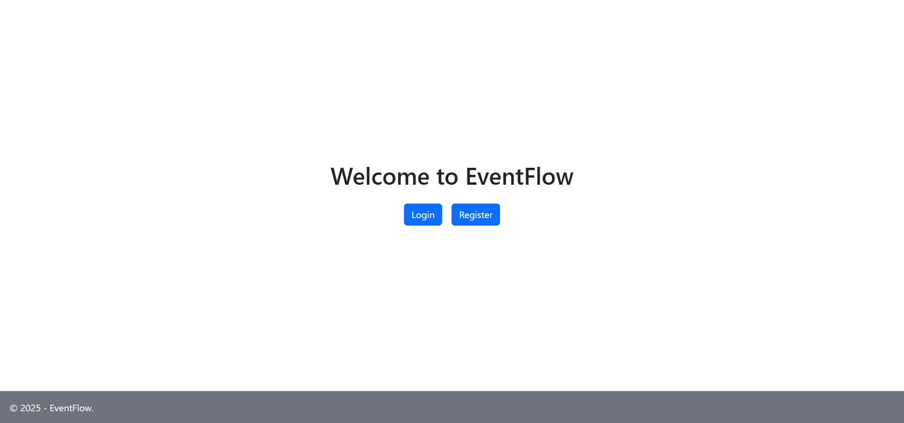

# Eventflow - A smart calendar for everyone
---
Eventflow is a full-stack web application for managing events and tracking holidays worldwide. Users can:

  📅 View national holidays by country
  🗓️ Maintain a personal calendar with custom events and tasks
  👥 Invite other users to collaborate on events
  ⏰ Set reminders and notifications for important dates

The project is built with ASP.NET Core (C#) for the backend and vanilla JavaScript for the frontend. Data is persisted securely in a relational database. The application is currently hosted on the Fontys servers via FileZilla.

🔗 [Live Demo](https://i546327.luna.fhict.nl/)

---
## Tech Stack
  - Backend: ASP.NET Core (C#)
  - Frontend: Vanilla JavaScript, HTML, CSS
  - Database: SQL Server / PostgreSQL
  - Hosting: Fontys Server (via FileZilla FTP)

---
## Getting started
  1) Prerequisites
     -  .NET SDK 8
     -  SQL Server
     -  A code editor like VS Code

  2) Clone & Restore
     ```bash
     git clone https://github.com/DimitarMalamski/Eventflow.git
     cd Eventflow
     dotnet restore
     ``` 

  3) Database Setup
     Since Eventflow uses custom SQL queries instead of EF Core, you'll need to create the database manually.
     - Create a new database (e.g., `EventflowDb`) in your SQL engine.
     - Run the SQL script(s) provided in `Eventflow - Documentation\Database`.
      ```sql
      -- Example: scheme.sql
      CREATE TABLE Users (...);
      CREATE TABLE Events (...);
      CREATE TABLE Holidays (...);
      ```

     - Update the connection string in `appsettings.Development.json`:
     ```json
       {
        "ConnectionStrings": {
          "DefaultConnection": "Server=localhost;Database=EventflowDb;User Id=youruser;Password=yourpassword;"
        }
      }
     ```
  4) Run The Application
     ```bash
     dotnet run --project src/Eventflow.Web
     ```
     By default, the app will start on:
     -  http://localhost:5000
     -  https://localhost:5001

  5) ( Optional ) Run With VS
     1. Open the solution in VS.
     2. Set `Eventflow.Web` as the Startup Project.
     3. Press F5 to run.

---
## 📸 Screenshots

### Index page


### Login page


### Register page


### Calendar page


### Personal Calendar page


### Create Event page


### Inbox page


### Reminders page


---
## Roadmap / Future Improvements
  - Email notifications for upcoming events;
  - Multiple calendar support;  
  - Google Calendar integration;
  - Shared calendar for groups;
---

## 📝 License
This project is for educational purposes as part of Fontys University coursework.
